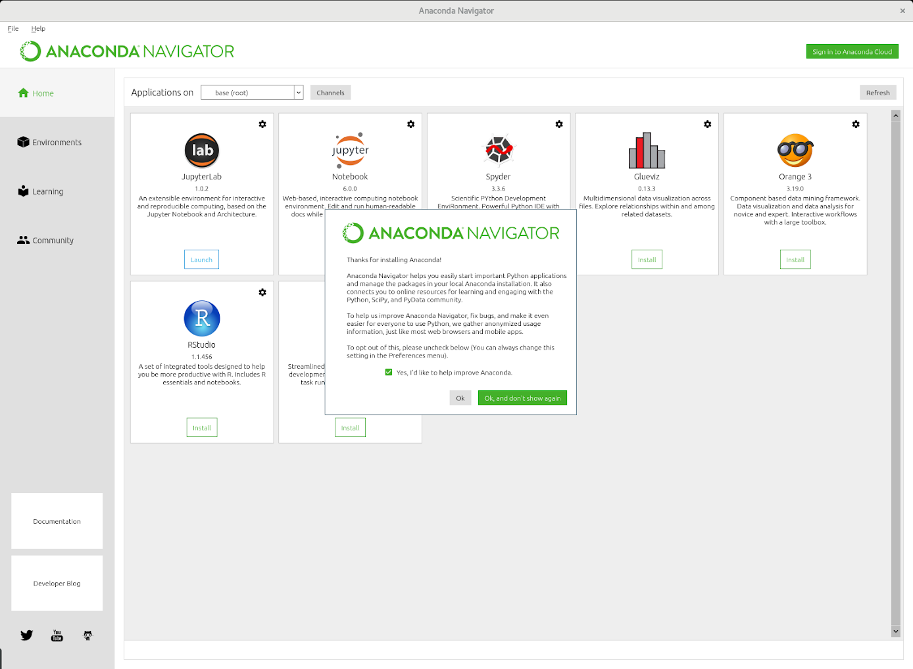
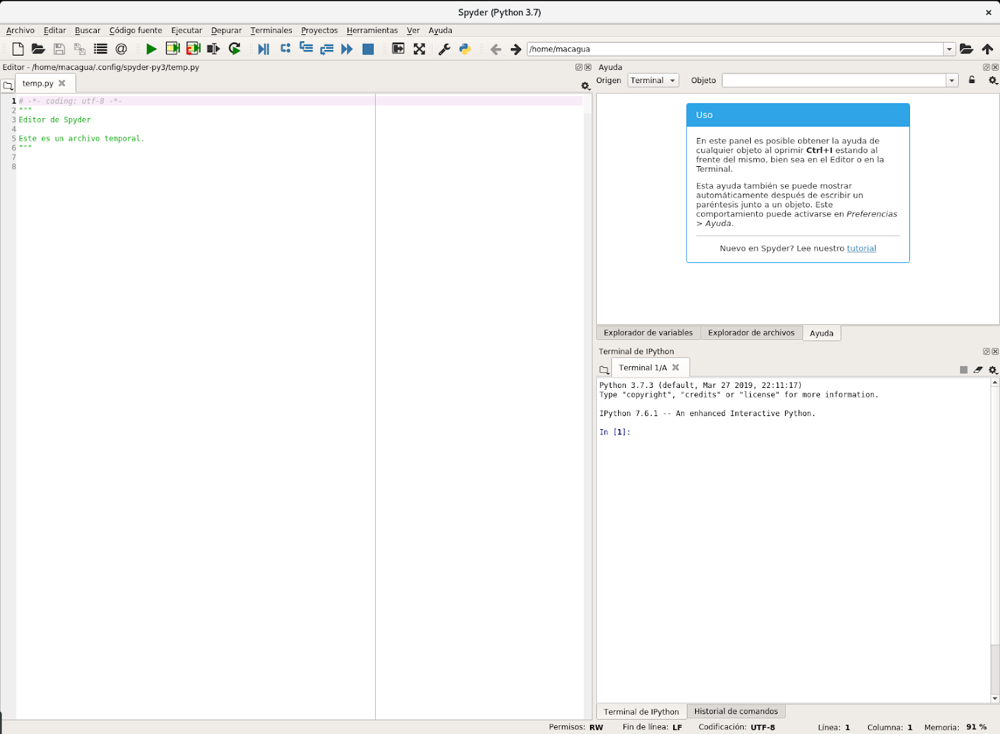
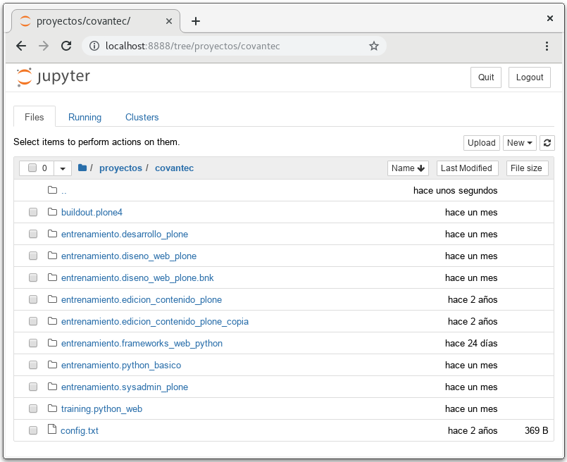

.. -*- coding: utf-8 -*-

.. _python_anaconda:

Entorno de desarrollo Anaconda
------------------------------

Este articulo es un tutorial con las instrucciones para instalar la
distribución Anaconda con el instalador para distribuciones
Windows 10/Debian 9 (Stretch) y Python.

Introducción
............

`Anaconda <https://www.anaconda.com/>`__, *La distribución
más confiable para la ciencia de datos*, es un administrador
de paquetes, un administrador de entorno, una distribución
de ciencia de datos Python/R y una colección de `más de
1,500+ paquetes de código
abierto <https://docs.anaconda.com/free/anaconda/reference/packages/pkg-docs/>`__.

Ofrece una de la forma más fácil de realizar la ciencia de
datos y el aprendizaje automático de Python/R en los
sistemas operativos Linux, Windows y Mac OS X.

    Logotipo de Anaconda

Es el estándar de la industria para desarrollar, probar y capacitar en
una sola máquina, que permite a *los científicos de datos individuales*
realizar:

-  Descarga rápidamente más de 1,500 paquetes de ciencia de
   datos en Python/R.

-  Administre bibliotecas, dependencias y entornos con la
   herramienta `Conda. <https://conda.io/en/latest/>`__

-  Desarrolle y capacite modelos de aprendizaje automático (*Machine Learning*)
   y aprendizaje profundo (*Deep Learning*) con las librerías
   `scikit-learn <https://scikit-learn.org/stable/>`__, `TensorFlow <https://www.tensorflow.org/>`__
   y `Theano <https://pypi.org/project/Theano/>`__.

-  Analice los datos con escalabilidad y rendimiento con las
   librerías `Dask <https://www.dask.org/>`__, `NumPy <https://numpy.org/>`__,
   `pandas <https://pandas.pydata.org/>`__ y `Numba <http://numba.pydata.org/>`__.

-  Visualice los resultados con las
   librerías `Matplotlib <https://matplotlib.org/>`__, `Bokeh <https://docs.bokeh.org/en/latest/>`__,
   `Datashader <https://datashader.org/>`__ y `Holoviews <https://holoviews.org/>`__.

Requisitos previos
..................

Para instalar Anaconda debe instalar dependencias mínimas
necesarias, con el siguiente comando:

.. code-block:: console

    $ sudo apt install libgl1-mesa-glx libegl1-mesa libxrandr2 \
                        libxrandr2 libxss1 libxcursor1 libxcomposite1 \
                        libasound2 libxi6 libxtst6 wget

Luego debe descargar el instalador de la distribución
Anaconda, ejecutando el siguiente comando:

.. code-block:: console

    $ wget https://repo.anaconda.com/archive/Anaconda3-2023.09-0-Linux-x86_64.sh

Así de esta forma esta listo para ejecutar el instalador de
la distribución Anaconda, en la sección siguiente se
explicara como ejecutarlo.

Instalación
...........

Para ejecutar el instalador de la distribución Anaconda,
debe otorgar permisos de ejecución, ejecutando el siguiente
comando:

.. code-block:: console

    $ chmod 755 ./Anaconda3-2023.09-0-Linux-x86_64.sh

Entonces luego de otorgar permisos de ejecución ya esta
listo para iniciar el instalador de la distribución
Anaconda, ejecutando el siguiente comando:

.. code-block:: console

    $ ./Anaconda3-2023.09-0-Linux-x86_64.sh

Siga y respondas las preguntas realizadas por el instalador
a continuación. Al finalizar la instalación dispone lo
siguiente paquetes disponibles en Anaconda:

-  Más de `200 paquetes <https://docs.anaconda.com/free/anaconda/reference/packages/pkg-docs/>`__
   se instalan automáticamente con Anaconda.

-  Más de 2000 paquetes de código abierto adicionales
   (incluida R) se pueden instalar individualmente desde el
   repositorio de Anaconda con el comando ``conda install``

-  Miles de otros paquetes están disponibles en `Anaconda
   Cloud <https://anaconda.org/account/login>`__.

-  Puede descargar otros paquetes usando el comando ``pip install`` que se
   instala con Anaconda. Los `paquetes
   Pip <https://conda.io/projects/conda/en/latest/user-guide/tasks/manage-pkgs.html#installing-non-conda-packages>`__ proporcionan
   muchas de las características de los paquetes ``conda`` y,
   en algunos casos, pueden funcionar juntos. Sin embargo,
   la preferencia debe ser instalar el paquete ``conda`` si
   está disponible.

-  También puede crear sus propios
   `paquetes personalizados <https://conda.io/projects/conda-build/en/latest/>`__
   utilizando el comando ``conda build`` y puede compartirlos con otros
   usuarios subiéndolos a `Anaconda Cloud <https://anaconda.org/account/login>`__, PyPi u otros
   repositorios.

Usted puede instalar, eliminar o actualizar cualquier paquete de Anaconda/Python
con unos pocos clics en *Anaconda Navigator* o con un solo comando ``conda`` en
la consola de comando Anaconda (terminal en Linux o macOS).

Verificar la instalación
........................

Después de instalar Anaconda, si usted prefiere una interfaz
gráfica de usuario (GUI) de escritorio, use *Anaconda
Navigator*. Si prefiere usar la consola de comando Anaconda
(o el terminal en Linux o macOS),  con la herramienta
*conda*. También puedes cambiar entre ellos cuando lo
necesite.

Para usarlo abra la consola de comando en Anaconda activa en
Linux, después elija cualquiera de los siguientes métodos:

-  Si Anaconda está instalado y funcionando, usted puede
   mostrar una lista de los paquetes instalados y sus
   versiones, introduzca el siguiente comando:

.. code-block:: console

    $ conda list

-  Ejecutar el shell de Python, ejecutando el siguiente
   comando:

.. code-block:: console

    $ python

   Python 3.11.5 | packaged by Anaconda, Inc. | (main, Sep 11 2023, 13:26:23) [MSC v.1916 64 bit (AMD64)] on win32
   Type "help", "copyright", "credits" or "license" for more information.
   >>>

Si Anaconda está instalado y funcionando, la información de
la versión que muestra cuando se inicia incluirá «Anaconda».

Para salir del shell interactivo Python/Anaconda, ejecutando
el siguiente comando:

.. code-block:: pycon

    >>> quit()

De esta forma verifico que tiene instalado correctamente
instalado la distribución Anaconda.

.. _python_anaconda_conda:

Conda
.....

`Conda <https://docs.conda.io/en/latest/index.html>`__, es
una herramienta para administrar e implementar aplicaciones,
entornos y paquetes en Anaconda.

    Logotipo de CONDA

*Administración de paquetes, dependencias y entornos para
cualquier lenguaje — Python, R, Ruby, Lua, Scala, Java,
JavaScript, C / C ++, FORTRAN*

Es un sistema de gestión de paquetes de código abierto el
cual le permite:

-  Ser un sistema de gestión del entorno que se ejecuta en
   Windows, macOS y Linux.

-  Instala, ejecuta y actualiza rápidamente los paquetes y
   sus dependencias.

-  Crea, guarda, carga y cambia fácilmente entre los
   entornos de su computadora local.

Fue creado para los programas de Python, pero puede
empaquetar y distribuir software para cualquier lenguaje de
programación. Para más información sobre la herramienta
consulte la `documentación
disponible <https://conda.io/projects/conda/en/latest/index.html>`__.

`Anaconda
Navigator <https://docs.anaconda.com/free/navigator/>`__,
es una interfaz gráfica de usuario (GUI) de escritorio
incluida en la distribución de Anaconda® que le permite
iniciar aplicaciones y administrar fácilmente los
paquetes, entornos y canales de Conda sin usar los
comandos de la línea de comandos. El navegador puede
buscar paquetes en Anaconda Cloud o en un repositorio
local de Anaconda. Está disponible para Windows, macOS y
Linux.

Si Anaconda está instalado correctamente, puede abrir el
programa gráfico Anaconda Navigator, el cual se instala
automáticamente cuando instala Anaconda, entonces puede
abrirlo, ejecutando el siguiente comando:

.. code-block:: console

      $ anaconda-navigator

Seguidamente se abrirá la interfaz de *Anaconda
Navigator* como se muestra a continuación:

    Interfaz de *Anaconda Navigator* corriendo

Este mostrar la Interfaz de *Anaconda Navigator*
ejecutándose correctamente.

Aplicaciones en Anaconda
........................
La distribución de Anaconda incorpora varias aplicaciones
para el uso de la ciencia computacional, a continuación
describo las aplicaciones de principal uso cotidiano:

.. _python_anaconda_spider:

Spyder
......

`Spyder <https://www.spyder-ide.org/>`__\ , es un entorno
integrado de desarrollo enPythonpara ciencia
computacional, con muchas funcionalidades útiles para la
investigación, el análisis de datos y la creación
de paquetes científicos.

Para acceder al entorno integrado accediendo desde el
Anaconda Navigator en Home > Spyder > Launch, esto
ejecutara el entorno integrado, como se muestra a
continuación:

    Interfaz de *Spyder* corriendo

Este mostrar la Interfaz de *Spyder* ejecutándose
correctamente.

Jupyter Notebook
................

`JupyterNotebook <https://jupyter.org/>`__\ , es
una aplicación web de código abierto que permite crear y
compartir documentos que contienen código vivo,ecuaciones,
visualizaciones y texto narrativo.

Para acceder al entorno integrado accediendo desde el
Anaconda Navigator en Home > Notebook > Launch, esto
ejecutara el entorno integrado, como se muestra a
continuación:

    Interfaz de *Jupyter Notebook* corriendo

Este mostrar la Interfaz de *Jupyter Notebook* ejecutándose
correctamente.

.. tip::

   Para más entender su funcionamiento de la distribución
   Anaconda debe leer la `guía del
   usuario <https://docs.anaconda.com/free/anaconda/getting-started/>`__.

Conclusiones
............

De esta forma usted ha aprendido a:

-  **Introductorio** a la distribución Anaconda.

-  **Descargar dependencias** de la distribución Anaconda en Debian.

-  **Instalar** la distribución Anaconda en Debian.

-  **Verificar** la instalación en Debian.

-  **Ejecutar** el Anaconda Navigator.

-  **Abrir aplicaciones** incorporadas en Anaconda Navigator.

.. seealso::

    Consulte la sección de :ref:`lecturas suplementarias <lecturas_extras_leccion1>`
    del entrenamiento para ampliar su conocimiento en esta temática.

.. raw:: html
   :file: ../_templates/partials/soporte_profesional.html

.. disqus::
