.. _python_pkg_streamlit:

Streamlit
=========

.. note::
    **Propósito:** es una libraría permite la creación de Dashboard interactivos.

Es un framework de aplicación de código abierto (un paquete de Python) que nos
brinda el poder de crear aplicaciones atractivas sin ningún conocimiento de
desarrollo de front-end.

Esto nos libera de involucrarnos en cualquier marco de trabajo front-end o codificación
en HTML, CSS y JavaScript.

Utiliza Python puro para desarrollar su front-end.

    Logotipo de librería Streamlit

¿Cuándo usar Streamlit?
-----------------------

En primer lugar, si está codificando secuencias de comandos de Python que se ejecutan
regularmente en una máquina con un programador de trabajos como cron, Streamlit no es útil
para usted.

Pero si está desarrollando una herramienta que desea compartir con los miembros de su equipo,
por ejemplo, una aplicación de investigación de palabras clave, puede usar Streamlit.

Además, si necesita un método de autenticación de usuario, la comunidad Streamlit desarrolló
un paquete que puede manejarlo por usted.

.. _python_pkg_streamlit_instalar:

Instalación
-----------

Para instalar el paquete `streamlit`_ ejecute el siguiente comando, el cual
a continuación se presentan el correspondiente comando de tu sistema operativo:

.. tabs::

   .. group-tab:: Linux

      .. code-block:: console

          $ pip install streamlit

   .. group-tab:: Windows

      .. code-block:: console

          > pip install streamlit

Puede probar si la instalación se realizo correctamente, ejecutando
el siguiente comando correspondiente a tu sistema operativo:

.. tabs::

   .. group-tab:: Linux

      .. code-block:: console

          $ python -c "import streamlit ; print(streamlit.__version__)"

   .. group-tab:: Windows

      .. code-block:: console

          > python -c "import streamlit ; print(streamlit.__version__)"

Si muestra el numero de la versión instalada de ``streamlit``, tiene
correctamente instalada la paquete. Con esto, ya tiene todo listo para continuar.

---

.. _python_pkg_streamlit_hello:

Práctica - Hello
----------------

A continuación se presenta la ejecución de una demostración que incluye ``Streamlit``,
ejecutando el siguiente comando correspondiente a tu sistema operativo:

.. tabs::

   .. group-tab:: Linux

      .. code-block:: console

          $ streamlit hello

   .. group-tab:: Windows

      .. code-block:: console

          > streamlit hello

El anterior comando al ejecutar debe mostrar el siguiente mensaje:

.. code-block:: console

    Welcome to Streamlit. Check out our demo in your browser.

    Local URL: http://localhost:8501
    Network URL: http://172.28.94.109:8501

    Ready to create your own Python apps super quickly?
    Head over to https://docs.streamlit.io

    May you create awesome apps!

``Local URL``
    Dirección local de tu PC donde ejecuta esta demostración, valor por
    defecto es **http://localhost:8501**

``Network URL``
    Dirección de la red local de tu PC donde donde puede compartir la forma
    como accede a esta demostración.

Abra el navegador web en la dirección local definida en el valor ``Local URL``:

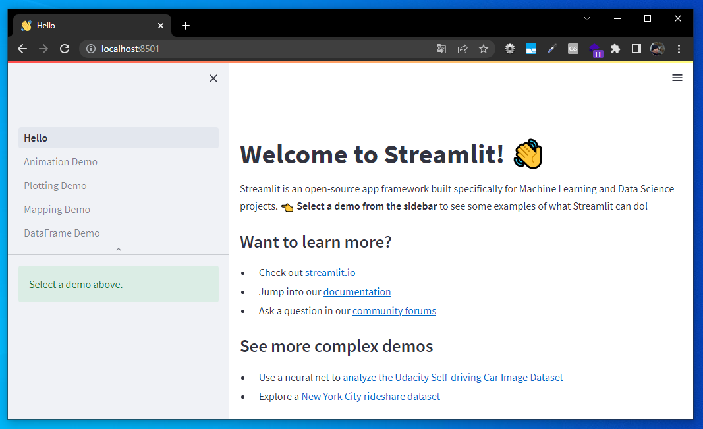

    Streamlit Hello - Welcome to Streamlit! 👋

----

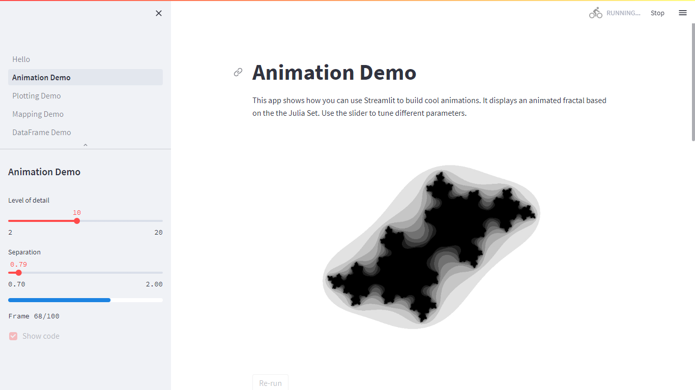

    Streamlit Hello - Animation Demo

Esta aplicación muestra cómo puede usar Streamlit para crear animaciones
geniales. Muestra un fractal animado basado en el conjunto de Julia. Utilice
el control deslizante para ajustar diferentes parámetros.

----

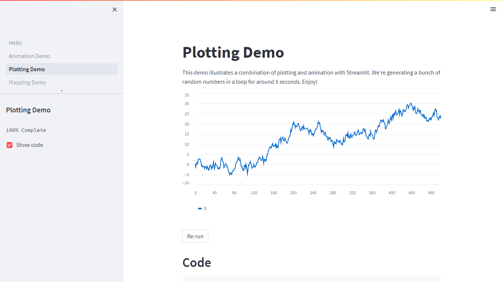

    Streamlit Hello - Plotting Demo

Esta demostración ilustra una combinación de Plotting y animación con Streamlit.
En este ejemplo se genera un montón de números aleatorios en un bucle durante
unos 5 segundos.

----

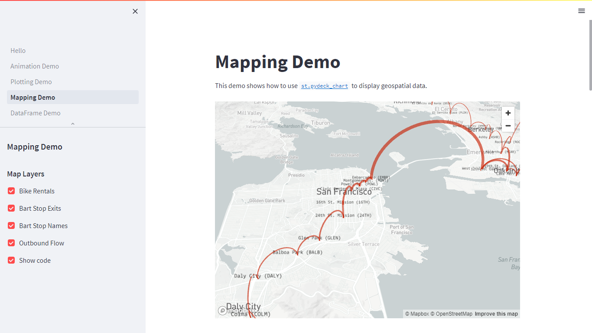

    Streamlit Hello - Mapping Demo

Esta demostración muestra cómo usar st.pydeck_chart para mostrar datos geoespaciales.

----

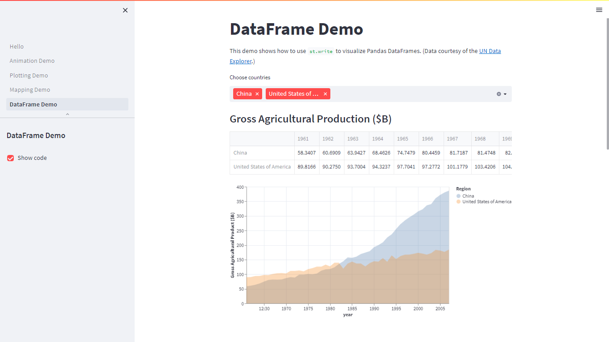

    Streamlit Hello - DataFrame Demo

Esta demostración muestra cómo usar st.write para visualizar Pandas DataFrames.
(Datos cortesía de `UN Data Explorer <http://data.un.org/Explorer.aspx>`_).

---

.. _python_pkg_streamlit_hello_word:

Práctica - Hello World
----------------------

A continuación se presenta una práctica del famoso `Hello World`_ usando con ``Streamlit``,
a continuación la estructura de proyecto llamado ``hello_word``:

.. code-block:: console

    hello_word/
    ├── __init__.py
    ├── app.py
    └── requirements.txt

A continuación se presenta y explica el uso de cada archivo para esta proyecto:

*Archivo app.py*

Módulo de principal del programa.

.. literalinclude:: ../../recursos/leccion5/streamlit/hello_word/app.py
    :language: python
    :linenos:
    :lines: 1-3

*Archivo requirements.txt*

Archivo de `requirements.txt`_ de la herramienta de gestión de paquetes `pip`_.

.. literalinclude:: ../../recursos/leccion5/streamlit/hello_word/requirements.txt
    :language: text
    :linenos:
    :lines: 1-1

A continuación se presenta la ejecución de una demostración personalizada de `Hello World`_,
ejecutando los siguientes comandos correspondiente a tu sistema operativo:

.. tabs::

   .. group-tab:: Linux

      .. code-block:: console

          $ pip install -r hello_word/requirements.txt
          $ streamlit run hello_word/app.py

   .. group-tab:: Windows

      .. code-block:: console

          > pip install -r hello_word/requirements.txt
          > streamlit run hello_word/app.py

El anterior comando al ejecutar debe mostrar el siguiente mensaje:

.. code-block:: console

    You can now view your Streamlit app in your browser.

    Local URL: http://localhost:8501
    Network URL: http://172.28.94.109:8501

``Local URL``
    Dirección local de tu PC donde ejecuta esta demostración, valor por
    defecto es **http://localhost:8501**

``Network URL``
    Dirección de la red local de tu PC donde donde puede compartir la forma
    como accede a esta demostración.

Abra el navegador web en la dirección local definida en el valor ``Local URL``:

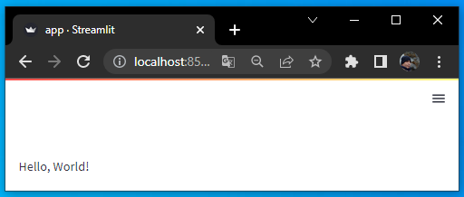

    Streamlit - Hello World

De esta forma tiene una práctica real de crear un mensaje Hello World y usado la
librería Streamlit.

---

.. _python_pkg_streamlit_dashboard:

Práctica - Dashboard
--------------------

A continuación se presenta una práctica de un Dashboard de análisis de ventas de
tres (03) sucursales a nivel nacional de una cadena de supermercado usando
con ``Streamlit``, a continuación la estructura de proyecto llamado ``dashboard``:

.. code-block:: console

    dashboard/
    ├── app.py
    ├── __init__.py
    ├── requirements.txt
    ├── .streamlit
    │   └── config.toml
    └── ventas_supermercado.xlsx

A continuación se presenta y explica el uso de cada archivo para esta proyecto:

*Archivo app.py*

Módulo de principal del programa.

.. literalinclude:: ../../recursos/leccion5/streamlit/dashboard/app.py
    :language: python
    :linenos:
    :lines: 1-137

*Archivo .streamlit/config.toml*

Archivo de configuración de proyecto Streamlit.

.. literalinclude:: ../../recursos/leccion5/streamlit/dashboard/.streamlit/config.toml
    :language: python
    :linenos:
    :lines: 1-16

*Archivo requirements.txt*

Archivo de `requirements.txt`_ de la herramienta de gestión de paquetes `pip`_.

.. literalinclude:: ../../recursos/leccion5/streamlit/dashboard/requirements.txt
    :language: text
    :linenos:
    :lines: 1-4

*Archivo ventas_supermercado.xlsx*

Archivo de la hoja de calculo de ``Microsoft Excel`` llamado :file:`ventas_supermercado.xlsx`
la cual no se incluye ya que cada vez que se inicia el programa :file:`app.py`, para cuidar la
creación de los datos iniciales.

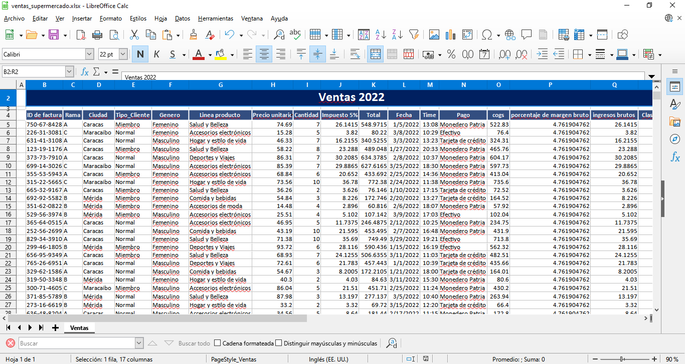

    Archivo de Excel ventas_supermercado.xlsx

A continuación se presenta la ejecución de una demostración personalizada de ``Tablero de Ventas``,
ejecutando los siguientes comandos correspondiente a tu sistema operativo:

.. tabs::

   .. group-tab:: Linux

      .. code-block:: console

          $ pip install -r dashboard/requirements.txt
          $ streamlit run dashboard/app.py

   .. group-tab:: Windows

      .. code-block:: console

          > pip install -r dashboard/requirements.txt
          > streamlit run dashboard/app.py

El anterior comando al ejecutar debe mostrar el siguiente mensaje:

.. code-block:: console

    You can now view your Streamlit app in your browser.

    Local URL: http://localhost:8501
    Network URL: http://172.28.94.109:8501

``Local URL``
    Dirección local de tu PC donde ejecuta esta demostración, valor por
    defecto es **http://localhost:8501**

``Network URL``
    Dirección de la red local de tu PC donde donde puede compartir la forma
    como accede a esta demostración.

Abra el navegador web en la dirección local definida en el valor ``Local URL``:

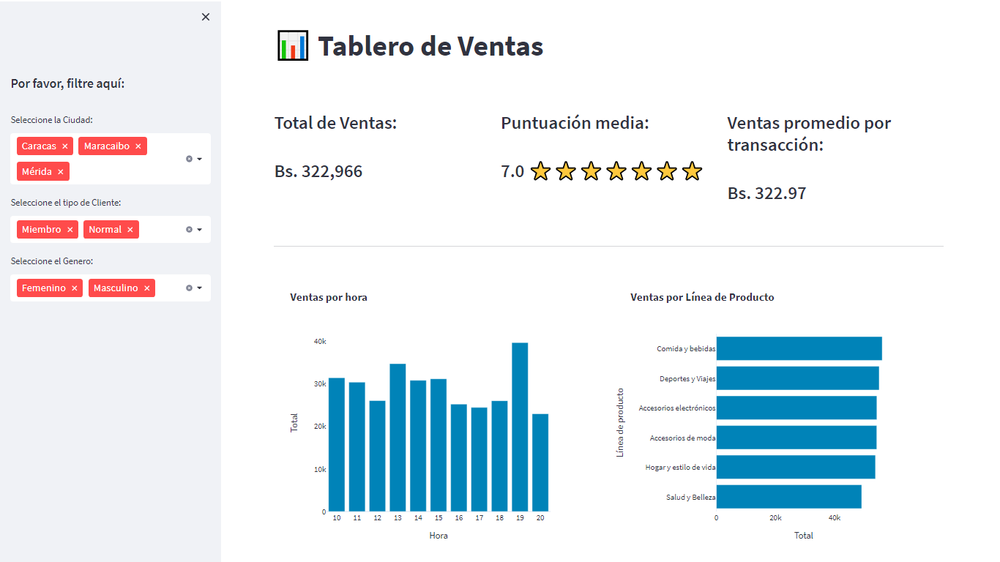

    Streamlit - Tablero de Ventas

De esta forma tiene una práctica real de crear un Tablero de Ventas, usando fuente
de datos desde una hoja de calculo de Excel y usado la librería Streamlit.

---

.. _python_pkg_streamlit_sqlite_crud:

Práctica - SQLite CRUD
----------------------

A continuación se presenta una práctica de un simple ``Blog`` que hace las operaciones
de manipulación CRUD para generar analítica de las entradas del Blog con ``Streamlit``,
a continuación la estructura de proyecto llamado ``sqlite_crud``:

.. code-block:: console

    sqlite_crud/
    ├── app.py
    ├── db_initial.py
    ├── db.py
    ├── .env.example
    ├── __init__.py
    ├── layouts.py
    ├── requirements.txt
    ├── settings.py
    ├── simple_blog.sqlite3
    └── .streamlit
        └── config.toml

A continuación se presenta y explica el uso de cada archivo para esta proyecto:

*Archivo app.py*

Módulo de principal del programa.

.. literalinclude:: ../../recursos/leccion5/streamlit/sqlite_crud/app.py
    :language: python
    :linenos:
    :lines: 1-525

*Archivo db_initial.py*

Módulo que agregar datos iniciales de la publicación de la entrada del blog.

.. literalinclude:: ../../recursos/leccion5/streamlit/sqlite_crud/db_initial.py
    :language: python
    :linenos:
    :lines: 1-88

*Archivo db.py*

Módulo de funciones de la base de datos SQLite.

.. literalinclude:: ../../recursos/leccion5/streamlit/sqlite_crud/db.py
    :language: python
    :linenos:
    :lines: 1-77

*Archivo .env.example*

Archivo plantilla `dotenv`_ del paquete adicional `python-dotenv`_.

.. literalinclude:: ../../recursos/leccion5/streamlit/sqlite_crud/.env.example
    :language: text
    :linenos:
    :lines: 1-22

*Archivo layouts.py*

Módulo de plantillas de diseño Streamlit.

.. literalinclude:: ../../recursos/leccion5/streamlit/sqlite_crud/layouts.py
    :language: python
    :linenos:
    :lines: 1-52

*Archivo requirements.txt*

Archivo de `requirements.txt`_ de la herramienta de gestión de paquetes `pip`_.

.. literalinclude:: ../../recursos/leccion5/streamlit/sqlite_crud/requirements.txt
    :language: text
    :linenos:
    :lines: 1-7

*Archivo settings.py*

Módulo de configuración de "Simple Blog"

.. literalinclude:: ../../recursos/leccion5/streamlit/sqlite_crud/settings.py
    :language: python
    :linenos:
    :lines: 1-65

*Archivo simple_blog.sqlite3*

Archivo de la hoja de calculo de ``SQLite`` llamado :file:`simple_blog.sqlite3`
la cual no se incluye ya que cada vez que se inicia el programa :file:`app.py`, para
cuidar la creación de los datos iniciales.

*Archivo .streamlit/config.toml*

Archivo de configuración de proyecto Streamlit.

.. literalinclude:: ../../recursos/leccion5/streamlit/sqlite_crud/.streamlit/config.toml
    :language: python
    :linenos:
    :lines: 1-19

.. comments:

    .. figure:: ../_static/images/streamlit_ventas_supermercado_xlsx.png
        :align: center
        :width: 60%

        Archivo de SQLite simple_blog.sqlite3

A continuación se presenta la ejecución de una demostración de ``Simple Blog``,
ejecutando los siguientes comandos correspondiente a tu sistema operativo:

.. tabs::

   .. group-tab:: Linux

      Antes de ejecutar debes instalar sus dependencias, con el siguiente comando:

      .. code-block:: console

          $ pip install -r requirements.txt

      Ademas debe instalar y editar el archivo :file:`.env`, con el siguiente comando:

      .. code-block:: console

          $ cp .env.example .env
          $ nano .env

      .. tip::
        El archivo :file:`.env` se definen las configuraciones de conexión a la base de datos,
        puede modificarlo cambiar valores de la conexión.

      .. tip::
        Para ejecutar el código fuente de esta práctica debe invocar primero al módulo :file:`db_initial.py`,
        abra una consola de comando, acceda al directorio donde se encuentra la estructura previa
        y ejecute el siguiente comando:

      .. code-block:: console

          $ python db_initial.py

      El anterior código al ejecutar debe mostrar el siguiente mensaje:

      .. code-block:: console

          INFO:root:Database creation 'simple_blog.sqlite3' was successful!
          INFO:root:Connection to database 'simple_blog.sqlite3' was established successfully!
          INFO:root:The table was created successfully!
          INFO:root:The cursor for create database table was closed successfully!
          INFO:root:¡3 record(s) was(were) successfully added to the table!
          INFO:root:The cursor for data initial of blog entry posts was closed successfully!
          INFO:root:Disconnect to database 'simple_blog.sqlite3' was closed successfully!

      .. tip::
        Para ejecutar el código fuente de esta práctica debe invocar al módulo :file:`app.py`,
        abra una consola de comando, acceda al directorio donde se encuentra la estructura previa
        y ejecute el siguiente comando:

      .. code-block:: console

          $ streamlit run app.py

      El anterior comando al ejecutar debe mostrar el siguiente mensaje:

      .. code-block:: console

          You can now view your Streamlit app in your browser.

          Local URL: http://localhost:8501
          Network URL: http://172.28.94.109:8501

   .. group-tab:: Windows

      Antes de ejecutar debes instalar sus dependencias, con el siguiente comando:

      .. code-block:: console

          > pip install -r requirements.txt

      Ademas debe instalar y editar el archivo :file:`.env` con el siguiente comando:

      .. code-block:: console

          > COPY .env.example .env
          > notepad.exe .env

      .. tip::
        El archivo :file:`.env` se definen las configuraciones de conexión a la base de datos,
        puede modificarlo cambiar valores de la conexión.

      .. tip::
        Para ejecutar el código fuente de esta práctica debe invocar primero al módulo :file:`db_initial.py`,
        abra una consola de comando, acceda al directorio donde se encuentra la estructura previa
        y ejecute el siguiente comando:

      .. code-block:: console

          > python db_initial.py

      El anterior código al ejecutar debe mostrar el siguiente mensaje:

      .. code-block:: console

          INFO:root:Database creation 'simple_blog.sqlite3' was successful!
          INFO:root:Connection to database 'simple_blog.sqlite3' was established successfully!
          INFO:root:The table was created successfully!
          INFO:root:The cursor for create database table was closed successfully!
          INFO:root:¡3 record(s) was(were) successfully added to the table!
          INFO:root:The cursor for data initial of blog entry posts was closed successfully!
          INFO:root:Disconnect to database 'simple_blog.sqlite3' was closed successfully!

      .. tip::
        Para ejecutar el código fuente de esta práctica debe invocar al módulo :file:`app.py`,
        abra una consola de comando, acceda al directorio donde se encuentra la estructura previa
        y ejecute el siguiente comando:

      .. code-block:: console

          > streamlit run app.py

      El anterior comando al ejecutar debe mostrar el siguiente mensaje:

      .. code-block:: console

          You can now view your Streamlit app in your browser.

          Local URL: http://localhost:8501
          Network URL: http://172.28.94.109:8501

.. note::
    ``Local URL``
        Dirección local de tu PC donde ejecuta esta demostración, valor por
        defecto es **http://localhost:8501**

    ``Network URL``
        Dirección de la red local de tu PC donde donde puede compartir la forma
        como accede a esta demostración.

Abra el navegador web en la dirección local definida en el valor ``Local URL``:

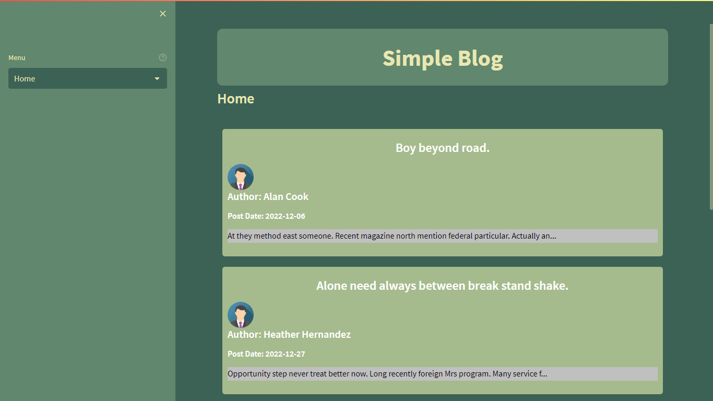

    Streamlit - SQLite CRUD - Home View

----

.. figure:: ../_static/images/streamlit_sqlite_crud_blog_view.png
    :align: center
    :width: 60%

    Streamlit - SQLite CRUD - View Posts

----

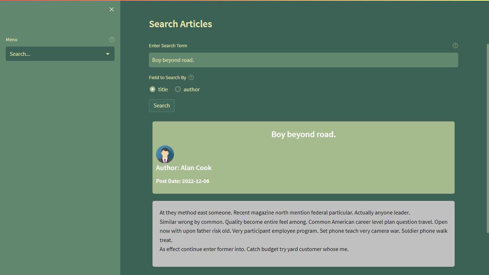

    Streamlit - SQLite CRUD - Search by title or author

----

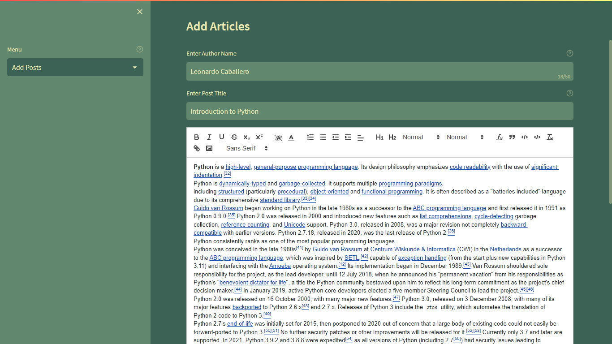

    Streamlit - SQLite CRUD - Add Posts

----

.. figure:: ../_static/images/streamlit_sqlite_crud_blog_manage.png
    :align: center
    :width: 60%

    Streamlit - SQLite CRUD - Manage Blog

----

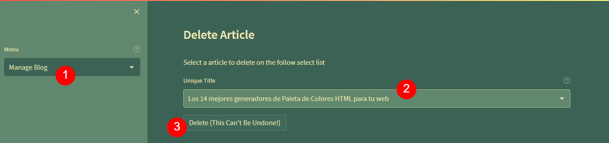

    Streamlit - SQLite CRUD - Delete Posts

----

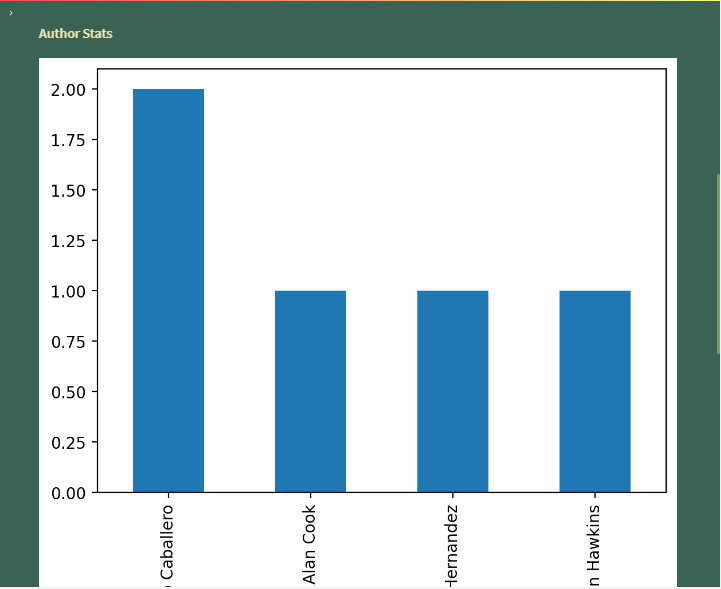

    Streamlit - SQLite CRUD - Generate Bar Plot Author Stats Metrics Graphic

----

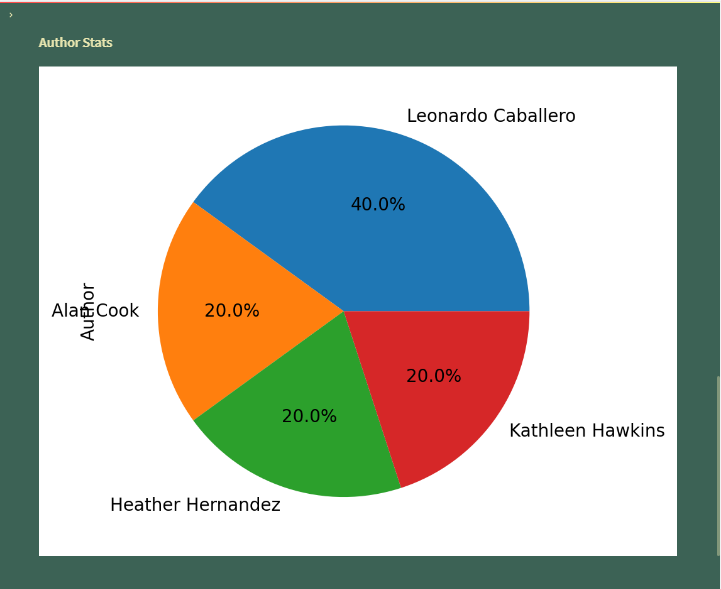

    Streamlit - SQLite CRUD - Generate Pie Plot Author Stats Metrics Graphic

----

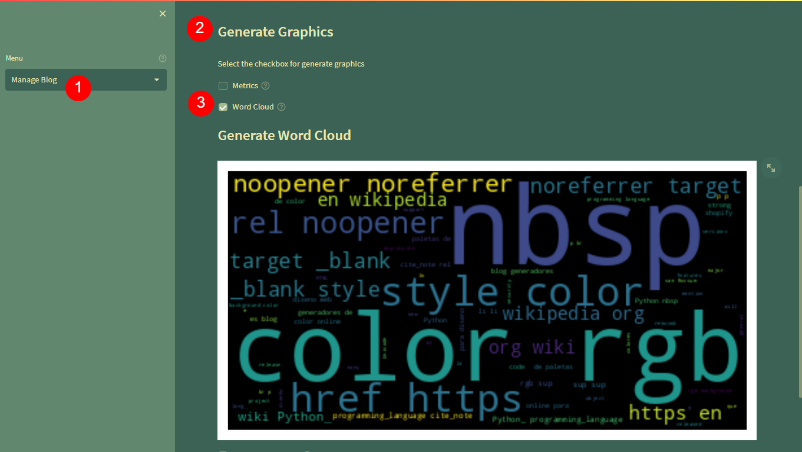

    Streamlit - SQLite CRUD - Generate Word Cloud Graphic

----

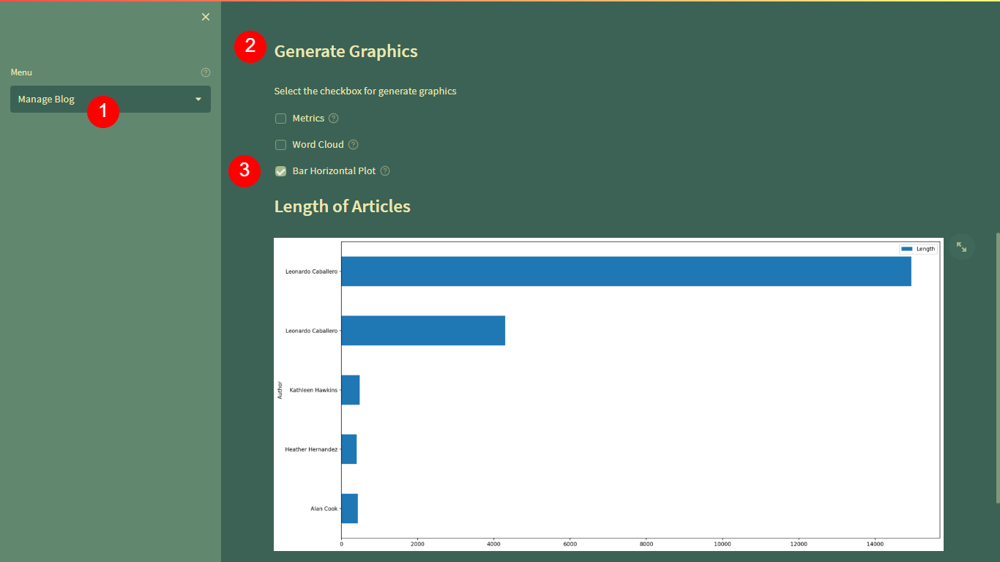

    Streamlit - SQLite CRUD - Generate Bar Horizontal Plot Graphic

.. comments:

    .. figure:: ../_static/images/streamlit_sqlite_crud_blog_update.png
        :align: center
        :width: 60%

        Streamlit - SQLite CRUD - Update Posts

    ----

    .. figure:: ../_static/images/streamlit_sqlite_crud_blog_about.png
        :align: center
        :width: 60%

        Streamlit - SQLite CRUD - About

De esta forma tiene una práctica real de crear un CRUD, usando fuente de datos
una base de datos SQLite y usado la librería Streamlit.

----

.. seealso::

    Consulte la sección de :ref:`lecturas suplementarias <lecturas_extras_leccion5>`
    del entrenamiento para ampliar su conocimiento en esta temática.

.. raw:: html
   :file: ../_templates/partials/soporte_profesional.html

.. disqus::

.. _`streamlit`: https://pypi.org/project/streamlit/
.. _`requirements.txt`: https://pip.pypa.io/en/stable/reference/requirements-file-format/
.. _`pip`: https://pip.pypa.io/en/stable/
.. _`dotenv`: https://dev.to/emma_donery/python-dotenv-keep-your-secrets-safe-4ocn
.. _`python-dotenv`: https://pypi.org/project/python-dotenv/
.. _`Hello World`: https://es.wikipedia.org/wiki/Hola_mundo
